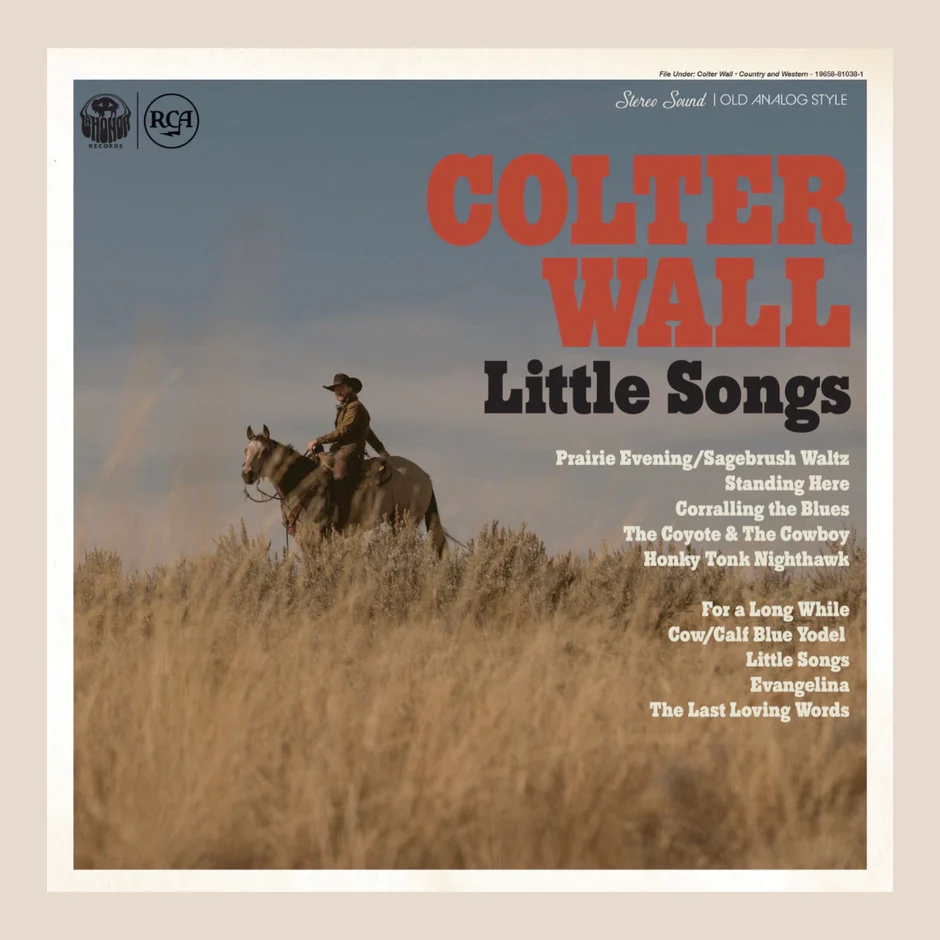

# m3-hw3-meadows-nicklaus

assignment3

# Colter Wall: A Dark and Great Version of Country Music

Colter Wall's music takes us back to a version of country that we have carrying a great tune and enjoyable beat.

[colter wall wiki page](https://en.wikipedia.org/wiki/Colter_Wall)

Colter Wall describes his music as "a mix of folk, blues, and Americana." Record labels Wall has been associated with include RCA La Honda, Thirty Tigers and Young Mary's.

Many of his songs have also been used in movies, including _Hell or High Water_ and _Three Billboards Outside Ebbing, Missouri_

## Discography

1. Imaginary Appalachia
2. Songs of the Plains
3. Western Swing
4. Little Songs

## Tour

[ticketmaster tour link](https://www.ticketmaster.com/colter-wall-tickets/artist/2258545)

2024 Colter Wall Tour Dates

## Life

Colter Wall was born in 1995 in Saskatchewan, Canada. At 13 he started to play the guitar and was highly influenced by American hair-bands. 2 years later, he heard a song by Bob Dylan and decided to take up singing as well. He attended university in Saskatoon, until 2015 when he decided to pause his academic path and focus on a music career. That same year he also released his first EP, Imaginary Appalachia.

### Resources

[airbnb page link](https://www.airbnb.com/)

[search new music page link](https://open.spotify.com/search/colter%20wall)

[uber page link](https://uber.com/)
